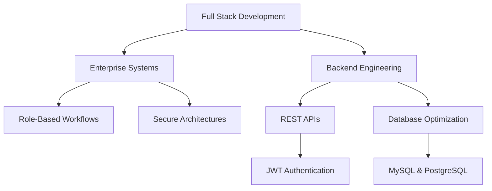

  
# Hi, I'm Siddharth Singh 

  

---
<table>
<tr>
<td valign="top" width="50%">
  
## 🚀 About Me

**Full Stack Engineer** — architecting secure, role-based enterprise systems.

Software engineer with full-stack & backend experience utilizing React, JavaScript, Java, Spring Boot, and MySQL. Experienced in creating REST APIs spanning authentication, authorization, audit logging, and workflow automation.

Currently pursuing my Master of Computer Applications (MCA) at Adamas University, with previous experience as a Software Engineer Trainee at Nvisagecomp Solutions LLP. Skilled in translating complex logic into seamless front-end experiences.

<td valign="top" width="50%">

</td>
</tr>
</table>
---

## 💼 Core Expertise

 Frontend

Backend

APIS

Languages

Databases

Tools

---

## 🏆 Achievements & Certifications

| Achievement / Certification | Details |
|:--|:--|
| **LeetCode** | 150+ problems solved (Data Structures & Algorithms) |
| **SAP BTP Solution Architect** | Certified Professional |
| **Oracle Cloud Infrastructure** | Certified Professional |
| **Academics** | MCA (8.5/10 CGPA) & BCA (2021-2024, 7.0/10 CGPA) |

---

## 🎯 Professional Focus Areas

### 🏗️ Enterprise Backend Architecture
- **Role-Based Access Control (RBAC)** — Architecting secure, multi-role backend systems utilizing JWT authentication and Spring Security.
- **Workflow Automation** — Designing scalable approval chains and compliance systems capable of dynamic risk score evaluation.
- **Robust API Design** — Formulating database-backed RESTful endpoints with comprehensive error handling for high-concurrency environments.

### 💻 Full Stack & IoT Integration
- **Scalable Web Platforms** — Building responsive single-page applications utilizing modern React, ES6 JavaScript, and Tailwind CSS.
- **Real-Time IoT Dashboards** — Engineering secure, asynchronous web interfaces to process real-time metrics for hardware systems like Arduino and ESP32-CAM.
- **Performance Optimization** — Connecting frontends with Node.js and Spring Boot backends to eliminate integration bottlenecks and drastically reduce latency.

### 🔐 Cloud Infrastructure & System Reliability
- **Enterprise Ecosystems** — Implementing production-ready architectures backed by certifications as an SAP BTP Solution Architect and Oracle Cloud Infrastructure professional.
- **Production-Grade Code Quality** — Leveraging SonarQube within CI/CD pipelines to proactively identify and resolve critical server-side vulnerabilities.
- **Algorithmic Efficiency** — Applying strong foundations in Data Structures & Algorithms (150+ LeetCode problems solved) to optimize database queries and backend processing.
  
## 📊 GitHub Stats

  
  

  

  

## 🐍 Contribution Snake

  

## 📞 Let's Connect

**Open to:** Engineering Roles · Technical Leadership · Consulting

