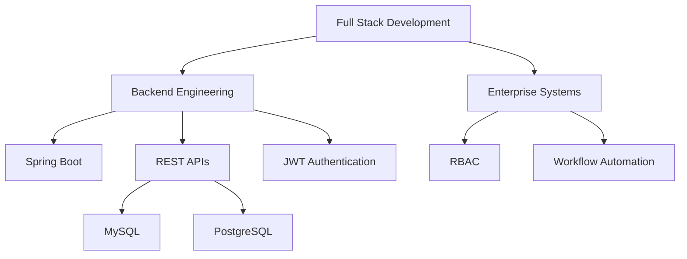

# Hi, I'm Siddharth Singh 👋

 

---

<table>
<tr>

<td width="55%" valign="top">

# 🚀 About Me

Backend-focused **Full Stack Engineer** passionate about building scalable enterprise applications.

- 💼 Software Engineer with experience in **Java, Spring Boot, React, TypeScript, Node.js**
- 🔐 Strong knowledge of **JWT Authentication, RBAC & Spring Security**
- 🌐 Designing REST APIs, enterprise workflows and secure architectures
- 🎓 MCA Student at **Adamas University**
- 💻 150+ LeetCode Problems Solved
- ☁️ SAP BTP & Oracle Cloud Certified
- 🚀 Open to Full Stack & Backend Engineering Roles

</td>

<td width="45%" align="center">

</td>

</tr>
</table>

---

# 💼 Core Expertise

## 🎨 Frontend

## ⚙️ Backend

## 🔌 APIs & Security

## 💻 Languages

## 🗄️ Databases

## 🛠 Tools

---

# 🏆 Achievements & Certifications

| Achievement | Details |
|--------------|---------|
| 🏅 LeetCode | 150+ DSA Problems Solved |
| ☁️ SAP BTP | Solution Architect Certified |
| ☁️ Oracle Cloud | Infrastructure Certified |
| 🎓 MCA | Adamas University |
| 💼 Backend | Java • Spring Boot • React |

---

# 🎯 Professional Focus

## 🏗 Enterprise Backend

- Role Based Access Control (RBAC)
- JWT Authentication
- Spring Security
- RESTful API Development
- Database Optimization
- Workflow Automation

## 💻 Full Stack Development

- React + TypeScript
- Spring Boot + MySQL
- Node.js + Express
- Tailwind CSS
- Responsive UI
- Enterprise Dashboards

## ☁️ Cloud & DevOps

- Docker
- Kubernetes
- GitHub Actions
- Maven
- SonarQube
- CI/CD
- SAP BTP
- Oracle Cloud

---
# 📊 GitHub Statistics

  
  

 

 

 

---

# 🏆 GitHub Trophies

---

# 🐍 Contribution Snake

---

# 📈 Contribution Calendar

---

# 💻 Current Tech Stack

| Frontend | Backend | Database | DevOps |
|-----------|----------|----------|---------|
| React • Next.js • TypeScript • Tailwind CSS | Java • Spring Boot • Node.js • Express | MySQL • PostgreSQL • MongoDB • SQLite | Docker • Kubernetes • GitHub Actions • Maven |

---

# 🚀 Featured Projects

| Project | Tech Stack |
|---------|------------|
| **TREK AI Travel Platform** | React • Spring Boot • Gemini AI |
| **AccessIQ** | Spring Boot • JWT • RBAC |
| **Vendor Compliance System** | React • Java • MySQL |
| **Smart IoT Door Lock** | Arduino • ESP32-CAM • OpenCV |

---

# 📞 Let's Connect

---

### 💙 Thanks for visiting my profile!

